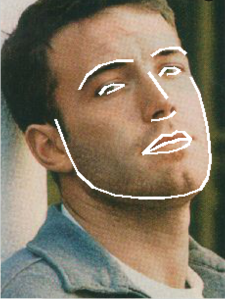
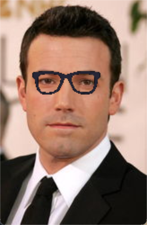
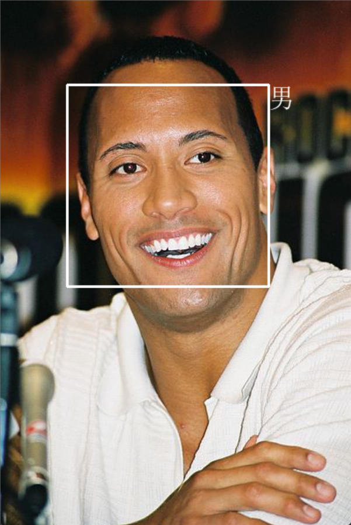
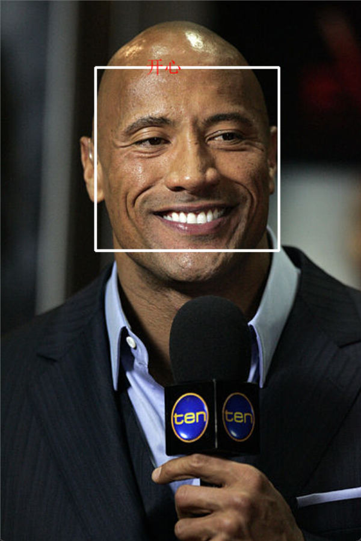
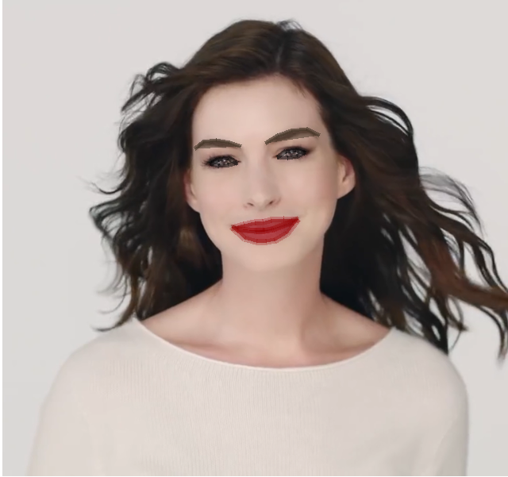

# opencv_practice
该项目通过复现 [faceai](https://github.com/vipstone/faceai/tree/master) 练习opencv。     
     
入门级 AI 项目，内容涵盖：人脸、视频、文字的检测和识别。他不仅包含最基本的人脸检测、识别（图片、视频）、轮廓标识、头像合成（给人戴帽子），还有表情识别（生气、厌恶、恐惧等）等等。

# 功能 #

1. 人脸检测、识别（图片、视频）
2. 轮廓标识
3. 头像合成（给人戴帽子）
4. 数字化妆（画口红、眉毛、眼睛等）
5. 性别识别
6. 表情识别（生气、厌恶、恐惧、开心、难过、惊喜、平静等七种情绪）

# 开发环境 #

- Windows 11（x64）
- Python 3.6.4
- OpenCV 3.4.1
- Dlib 19.8.1
- face_recognition 1.2.2
- keras 2.1.6
- tensorflow 1.8.0
- Tesseract OCR 4.0.0-beta.1

----------

# 功能预览 #

**绘制脸部轮廓**

----------

**头像特效合成**

----------

**性别识别**

----------

**表情识别**

----------

**数字化妆**

----------

**视频（监控）人脸检测与识别**

大家可以自己去试试，还是很有趣的，这里我就不放演示视频了。

----------

# 技术方案 #

技术实现方案介绍

	人脸识别：OpenCV / Dlib
	
	人脸检测：face_recognition
	
	性别识别：keras + tensorflow
	
	文字识别：Tesseract OCR
